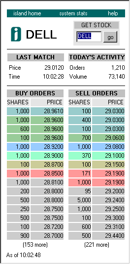

# island-order-book

This program uses `awk` to reconstruct Island's order book from ITCH data files, providing various data files for further statistical analysis.

ITCH is a proprietary data format used by the Island electronic trading platform to transmit real-time information about orders, trades, and other events. Island ECN was founded in 1996, and acquired by Instinet in 2002, which itself was subsequently acquired by NASDAQ in 2005.

## Features

* Parses ITCH data and extracts relevant information about orders and trades
* Reconstructs Island's order book
* Produces data files from book states, such as events, trades, or best quotes
* Book state and best quotes can be extracted in full or at regular time intervals 


## Requirements

* `nawk`, `mawk`, or `gawk`
* `gzip` when compression is requested
* `bash` and `getopt` (GNU version) if the shell script is used to call the awk program


## Usage

To run the awk script, use the bash script `itch.sh`:

```
$./itch.sh --help
Usage: itch.sh [-h] [-o directory] [-t tickers] [-a actions] [-b book-levels] 
[-s snapshot] [-m max-display] [-l limit] [-l file-limit] [-p preferred-awk] 
[-z] [-v] [-d] file [file...]

where:
    -h, --help           show this help text
    -o, --output-dir     directory where extracted data will be stored
                         (defaults to '.')
    -t, --tickers        comma-separated list of stock tickers to work on
                         (e.g. 'AAPL,MSFT', defaults to '*')
    -a, --actions        comma-separated list of data to compute:
                         trace, tickers, book, events, best, trades, broken
                         (e.g. 'trace,tickers,best')
    -b, --book-levels    number of price level to save on both sides of
                         the book, for action 'book'
                         (e.g. 10, default to 5)
    -s, --snapshot       duration of the snapshot time intervals, in seconds,
                         for action 'book' and action 'best'
                         (e.g. 300 for 5 minutes, defaults to 0: output all)
    -m, --max-display    maximum number of orders to display per book side
                         in the book trace
                         (e.g. 15, defaults to 10, 0 means no limit)
    -l, --limit          maximum overall number of events to process
                         (e.g. 1000, defaults to 0: no limit)
    -f, --file-limit     maximum number of events to process per input file
                         (e.g. 100, defaults to 0: no limit)
    -p, --preferred-awk  preferred awk version to use
                         ('awk', 'gawk', 'mawk' or 'nawk', defaults to 'awk')
    -z, --zip            gzip each output file
    -v, --verbose        print feedback about what the script is doing
    -d, --debug          print debug information
```

## Example

Consider a ITCH data file `sample/S030800-v1.txt`, whose head is shown here:

```
2740107SS
2743778A        1S       70GLGC        200.0000000000Y
2747896A        2S      250NSOL        435.6250000000Y
2748927A        3S      500MSFT         97.1875000000Y
2750097A        4S     1000BYND         12.0000000000Y
2751700A        5B      100SUNW         94.0000000000Y
2753853A        6B     1000ZPLS         12.0000000000Y
2756497X        5      100
2757301X        4     1000
2758338A        7B      100BYND          3.5000000000Y
2758693X        7      100
2759746A        8B      100BYND          3.7500000000Y
2759963X        8      100
2760390A       10B       50AOL          51.8750000000Y
2760457A       11B     1000RDRT          3.8750000000Y
2760702A       12S     1300BIKR          1.7500000000Y
...

```
The actual file contains 1,836,543 ITCH (version 1) records, corresponding to all events that occurred on the Island book on March 8, 2020.

The command below produces various data files for the stock with ticker `MSFT` (Microsoft). Book and best quote data are snapshots taken every 300 seconds. Book data file reports the 5 first prices on the bid and on the ask side. A trace file of the reconstructed book is also produced. Books printed in this trace file show a maximum of 20 rows. The awk interpreter is `mawk`. Output data files will be stored into the subfolder `out`. 

```bash
$./itch.sh --verbose --actions trace,book,events,best,trades,broken \
--tickers=MSFT --snapshot 300 --book-levels 5 --max-display 20 \
--preferred-awk mawk --output-dir out sample/S030800-v1.txt
```

This command prints

```
[sample/S030800-v1.txt:1] ITCH data version 1 detected
[sample/S030800-v1.txt:1] Start of Day 2000-03-08
[sample/S030800-v1.txt:413247] Record 413247: 10000 records processed so far
[sample/S030800-v1.txt:711853] Record 711853: 20000 records processed so far
[sample/S030800-v1.txt:1048678] Record 1048678: 30000 records processed so far
[sample/S030800-v1.txt:1536085] Record 1536085: 40000 records processed so far
[sample/S030800-v1.txt:1836542] End of Day 2000-03-08
```

and creates the following data files:

```
MSFT-2000-03-08-BEST.txt
MSFT-2000-03-08-BOOK.txt
MSFT-2000-03-08-EVENTS.txt
MSFT-2000-03-08-TRACE.txt
MSFT-2000-03-08-TRADES.txt
```

Data files are simple tab-separated values. Dates are in ISO format. For instance, `MSFT-2000-03-08-BEST.txt` starts with:

```
day	        time      mtime  ticker  best_bid  best_ask  best_bid_q  best_ask_q
2000-03-08  07:38:09  270    MSFT    97.1875             0           500
2000-03-08  07:44:48  240    MSFT    93.0      97.1875   1           500
2000-03-08  07:47:40  960    MSFT    93.0      97.1875   1           500
2000-03-08  07:51:01   10    MSFT    93.0      97.1875   1           500
...
```

The trace file `MSFT-2000-03-08-TRACE.txt` shows visual representations of the book through time. For instance, at 7:55 a.m. and 470 milliseconds, the arrival of a new limit order (order #829) to sell 120 units at a minimum price of 127 dollars per share is depicted as follows:

```
*** Record 1210: 2000-03-08 07:55:00.470

ticker             : MSFT
day                : 2000-03-08
timestamp          : 28500470
event              : ORDER
order              : 829
is_new_ref         : 1
bs                 : S
shares             : 120
where              : away
price              : 127.0
visibility         : V
display            : Y

MSFT 2000-03-08 07:55:00.470
-------------------------------------------------------------------------
MSFT :  93.00000000/97.18750000 (1/500)
-------------------------------------------------------------------------
  [      171 Y]      1  93.00000000 |   [        3 Y]    500  97.18750000
  [      575 Y]   1000  92.81250000 |   [      286 Y]     50  98.75000000
  [      188 Y]      1  88.00000000 |   [      331 Y]      8 112.00000000
  [      269 Y]     10  85.00000000 |   [      816 Y]     59 116.00000000
  [      425 Y]      1   1.00000000 |   [      227 Y]    100 123.00000000
                                    |   [      829 Y]    120 127.00000000
                                    |   [      822 Y]    200 141.00000000
-------------------------------------------------------------------------
                         (5 orders)                            (7 orders)
```

The above output shows the state of the Island order book after the sell order has been inserted, with the bid prices listed on the left and the ask prices listed on the right, along with quantities. Prices are in dollars. The brackets on the left of each individual order display the identifier of the order (a number) and an indicator `Y` that the option to also display this order on NASDAQ has been selected.

## References

### Data format

* [ITCH version 1.00](https://web.archive.org/web/20010211124456/http://www.island.com/resources/designspecs/itch0100.htm)
* [ITCH version 2.00](http://www.nasdaqtrader.com/content/technicalsupport/specifications/dataproducts/tv-itch2.pdf)
* [pdf documentations](https://web.archive.org/web/*/http://www.island.com/pdfs/*) archived at the [Internet Archive](https://web.archive.org/)

### Historical background and institutional details 

* [The Island ECN, Inc. History](http://www.fundinguniverse.com/company-histories/the-island-ecn-inc-history/)
* Island's Decimalization Program: [FAQ](https://web.archive.org/web/20011212072922/http://www.island.com/decimals/faq.htm)
* Before switching to Java, Island's matching engine ran on FoxPro for DOS version 2.6:
[Island ECN 10th Birthday Source Code Release!](http://www.josh.com/notes/island-ecn-10th-birthday/)

### Screenshots

Island's order book was freely observable on www.island.com using [BookViewer](https://web.archive.org/web/20010802221717/http://www.island.com/bookviewer/help.htm). Here is a screenshot taken in the early 2000's:




## About awk programming

> _"Awk is a simple tool, but it is not a simple-minded tool. It is good for many small tasks, but it is not well suited for large programs. When a task outgrows awk, it is time to use a more general-purpose language like C."_ 

(attributed to Brian Kernighan)

This 1,600+ sloc awk program does not qualify as a _large program_, but is it probably larger than most awk programs. Still, developing such a medium sized awk script was pretty easy, as long as a a rather strict coding style regarding variable scope and naming is followed. `gawk`'s option `--dump-variables` proved very useful to catch scope mistakes.

Compatibility with the different versions of awk has been maintained throughout the project in order to retain the benefits of their respective best features. In particular, while its built-in linter and debugger makes `gawk` better for development, `mawk` is much faster when processing large data files. The cost of keeping such compatibility is to give up useful gawk-specific features, such as true multidimensional arrays, or advanced regex.

## Author

* **Christophe Bisière** 

## License

This project is licensed under the MIT License - see the [LICENSE](LICENSE) file for details
